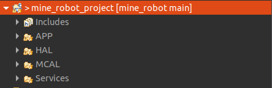
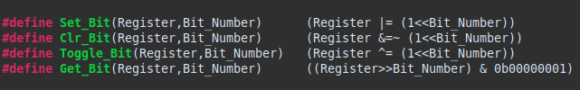
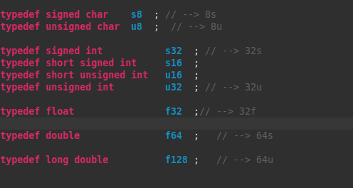
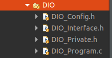
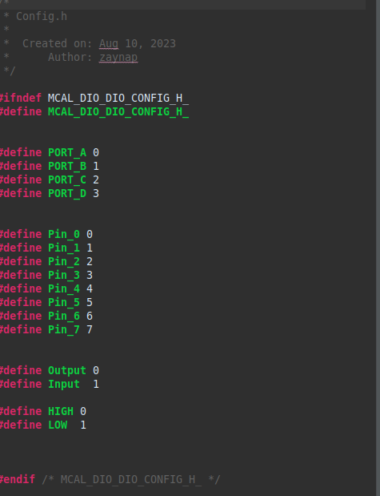
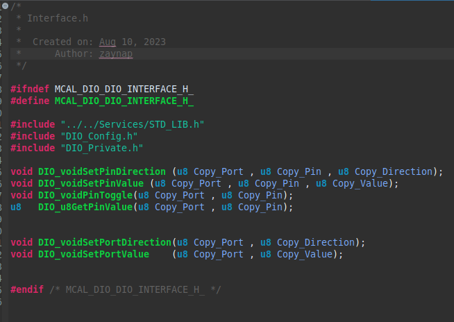
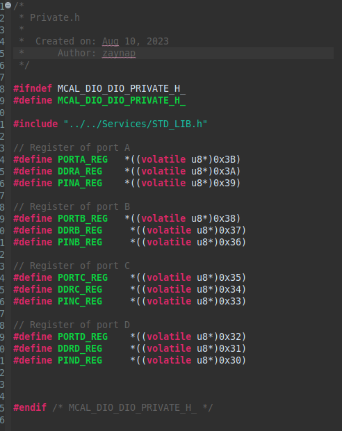
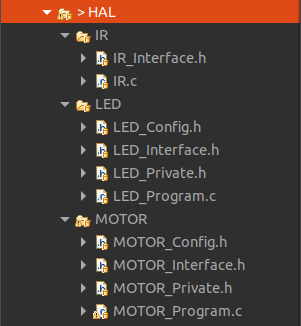
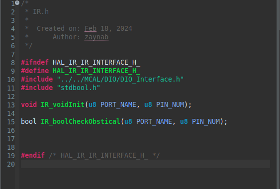
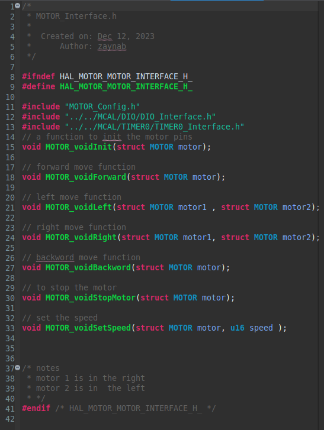

# mine_robot

**This document introduces a  mine detection robot designed for navigating potentially hazardous environments. The robot utilizes three infrared (IR) sensors: one facing forward and one on each side for obstacle detection.  These sensors, along with a mine detector sensor, guide the robot's movement.  Two DC motors propel the robot, allowing for forward and backward motion,  as well as turning capabilities.**

## for the software system of the project

### the archeticure of the system

* THE APP LAYER
* THE HAL LAYER
* THE MCAL LAYER
* THE SERVICES OF THE UTILS LAYER
  


### for the SERVICES LAYER :


the service layer have three files :

the bit_ math.h file includes :



This header file, Bit_Math.h, provides macros for performing common bitwise operations on registers in C.

#### Functionality:

* Set_Bit: Sets a specific bit in a register to 1.
* Clr_Bit: Clears a specific bit in a register to 0.
* Toggle_Bit: Flips the value of a specific bit in a register (0 to 1 or 1 to 0).
* Get_Bit: Retrieves the value of a specific bit in a register (1 or 0).

 **Benefits**:
Improves code readability by using descriptive macros instead of bitwise operators.
Enhances code maintainability by centralizing bit manipulation logic.

**and the STD_LIB.h**



This header prevents multiple inclusions and defines project-specific data types like s16 (signed 16-bit integer) and u32 (unsigned 32-bit integer), potentially mirroring standard types with comments hinting at bit width (e.g., // --> 16s).

### for the MCAL LAYER :

here i used three modules and i wrote their drivers:

* DIO MODULE
* EXT_ISR MODULE
* TIMER0 MODULE

EACH MODULE HAVE ITS OWN ARCHETECHURE :

* the private.h file
* the config.h file
* the interface.h file
* the program.c file



#### the DIO module :

##### the DIO_CONFIG.H FILE



##### the DIO_INTERFACE.H FILE



##### the DIO_PRIVATE.H FILE



##### the DIO_PROGRAM.C FILE

```C
/*
 * Program.c
 *
 *  Created on: Aug 10, 2023
 *      Author: zaynap
 */


#include "../../Services/STD_LIB.h"
#include "../../Services/Bit_Math.h"
#include "DIO_Config.h"
#include "DIO_Interface.h"


#include "DIO_Private.h"

/**/
void DIO_voidSetPinDirection(u8 Copy_Port,u8 Copy_Pin,u8 Copy_Direction)
{
	if(Copy_Direction == Output)
	{
		switch(Copy_Port)
		{
		case PORT_A : Set_Bit(DDRA_REG,Copy_Pin); break;
		case PORT_B : Set_Bit(DDRB_REG,Copy_Pin); break;
		case PORT_C : Set_Bit(DDRC_REG,Copy_Pin); break;
		case PORT_D : Set_Bit(DDRD_REG,Copy_Pin); break;
		}
	}
	else if(Copy_Direction == Input)
	{
		switch(Copy_Port)
		{
		case PORT_A : Clr_Bit(DDRA_REG,Copy_Pin); break;
		case PORT_B : Clr_Bit(DDRB_REG,Copy_Pin); break;
		case PORT_C : Clr_Bit(DDRC_REG,Copy_Pin); break;
		case PORT_D : Clr_Bit(DDRD_REG,Copy_Pin); break;
		}
	}
}

/* */
void DIO_voidSetPinValue(u8 Copy_Port, u8 Copy_Pin, u8 Copy_Value)
{
	if(Copy_Value == HIGH)
	{
		switch(Copy_Port)
		{
		case PORT_A : Set_Bit(PORTA_REG,Copy_Pin); break;
		case PORT_B : Set_Bit(PORTB_REG,Copy_Pin); break;
		case PORT_C : Set_Bit(PORTC_REG,Copy_Pin); break;
		case PORT_D : Set_Bit(PORTD_REG,Copy_Pin); break;
		}
	}
	else if(Copy_Value == LOW)
	{
		switch(Copy_Port)
		{
		case PORT_A : Clr_Bit(PORTA_REG,Copy_Pin); break;
		case PORT_B : Clr_Bit(PORTB_REG,Copy_Pin); break;
		case PORT_C : Clr_Bit(PORTC_REG,Copy_Pin); break;
		case PORT_D : Clr_Bit(PORTD_REG,Copy_Pin); break;
		}
	}
}

void DIO_voidPinToggle(u8 Copy_Port , u8 Copy_Pin)
{
	switch(Copy_Port)
	{
	case PORT_A : Toggle_Bit(PORTA_REG,Copy_Pin); break;
	case PORT_B : Toggle_Bit(PORTB_REG,Copy_Pin); break;
	case PORT_C : Toggle_Bit(PORTC_REG,Copy_Pin); break;
	case PORT_D : Toggle_Bit(PORTD_REG,Copy_Pin); break;
	}
}

u8 DIO_u8GetPinValue(u8 Copy_Port,u8 Copy_Pin)
{
	u8 Local_var ;
	switch(Copy_Port)
	{
	case PORT_A: Local_var = Get_Bit(PINA_REG,Copy_Pin); break;
	case PORT_B: Local_var = Get_Bit(PINB_REG,Copy_Pin); break;
	case PORT_C: Local_var = Get_Bit(PINC_REG,Copy_Pin); break;
	case PORT_D: Local_var = Get_Bit(PIND_REG,Copy_Pin); break;
	}

	return Local_var ;
}


void DIO_voidSetPortDirection(u8 Copy_Port , u8 Copy_Direction)
{
	switch(Copy_Port)
	{
	case PORT_A : DDRA_REG = Copy_Direction; break;
	case PORT_B : DDRB_REG = Copy_Direction; break;
	case PORT_C : DDRC_REG = Copy_Direction; break;
	case PORT_D : DDRD_REG = Copy_Direction; break;
	}
}


void DIO_voidSetPortValue    (u8 Copy_Port , u8 Copy_Value)
{
	switch(Copy_Port)
	{
	case PORT_A : PORTA_REG = Copy_Value; break;
	case PORT_B : PORTB_REG = Copy_Value; break;
	case PORT_C : PORTC_REG = Copy_Value; break;
	case PORT_D : PORTD_REG = Copy_Value; break;
	}
}

```

#### the EXT_ISR module:

the same arch for the DIO

##### the EXT_ISR_CONFIG.H FILE :

```c
/*
 * EXT_ISR_Config.h
 *
 *  Created on: Aug 24, 2023
 *      Author: zaynab
 */

#ifndef MCAL_EXT_ISR_EXT_ISR_CONFIG_H_
#define MCAL_EXT_ISR_EXT_ISR_CONFIG_H_

#define ANY_CHANGE 0
#define LOW_LEVEL 1
#define FALLING 2
#define RISING 3

#define ISR0_MODE ANY_CHANGE
#define ISR1_MODE ANY_CHANGE
#define ISR2_MODE FALLING  // only falling or rising

#define ENABLE 0
#define DISABLE 1

#define ISR0_STATE ENABLE

#define GIE_STATE ENABLE

#endif /* EXT_ISR_EXT_ISR_CONFIG_H_ */

```

##### THE EXT_ISR_Interface.H file :

```c
/*
 * EXT_ISR_Interface.h
 *
 *  Created on: Aug 24, 2023
 *      Author: zaynab
 */

#ifndef MCAL_EXT_ISR_EXT_ISR_INTERFACE_H_
#define MCAL_EXT_ISR_EXT_ISR_INTERFACE_H_


void __vector_1(void)__attribute__((signal));

void __vector_2(void)__attribute__((signal));

void __vector_3(void)__attribute__((signal));

void EXT_ISR0voidInit(void);
void EXT_ISR1voidInit(void);
void EXT_ISR2voidInit(void);

void EXT_GIE_STATEvoidInit(void);


#endif /* EXT_ISR_EXT_ISR_INTERFACE_H_ */

```

##### the EXT_ISR_program.H FILE

```c
/*
 * EXT_ISR_Program.c
 *
 *  Created on: Aug 24, 2023
 *      Author: zaynab
 */

#include "EXT_ISR_Config.h"
#include "EXT_ISR_Private.h"
#include "../../Services/Bit_Math.h"


void EXT_ISR0voidInit(void)
{
#if ISR0_MODE ==ANY_CHANGE
	// isr0 is on any_change mode
	Clr_Bit(MCUCR_REG,MCUCR_ISC01); // the mcuct is for the trigger option
	Set_Bit(MCUCR_REG,MCUCR_ISC00);

#elif ISR0_MODE ==FALLING
	// isr0 is on falling mode
	Set_Bit(MCUCR_REG,MCUCR_ISC01);
	Clr_Bit(MCUCR_REG,MCUCR_ISC00);

#elif ISR0_MODE ==RISING
	// isr0 is on rising mode
	Set_Bit(MCUCR_REG,MCUCR_ISC01);
	Set_Bit(MCUCR_REG,MCUCR_ISC00);

#elif ISR0_MODE ==LOW_LEVEL
	// isr0 is on low_level mode
	Clr_Bit(MCUCR_REG,MCUCR_ISC01);
	Clr_Bit(MCUCR_REG,MCUCR_ISC00);

#endif

#if ISR0_STATE==ENABLE
	Set_Bit(GICR_REG,GICR_INT0);
#elif ISR0_STATE==DISABLE
	Clr_Bit(GICR_REG,GICR_INT0);
#endif

}
void EXT_ISR1voidInit(void)
{

#if ISR1_MODE ==ANY_CHANGE
	// isr0 is on any_change mode
	Clr_Bit(MCUCR_REG,MCUCR_ISC11);
	Set_Bit(MCUCR_REG,MCUCR_ISC10);

#elif ISR1_MODE ==FALLING
	// isr0 is on falling mode
	Set_Bit(MCUCR_REG,MCUCR_ISC11);
	Clr_Bit(MCUCR_REG,MCUCR_ISC10);

#elif ISR1_MODE ==RISING
	// isr0 is on rising mode
	Set_Bit(MCUCR_REG,MCUCR_ISC11);
	Set_Bit(MCUCR_REG,MCUCR_ISC10);

#elif ISR1_MODE ==LOW_LEVEL
	// isr0 is on low_level mode
	Clr_Bit(MCUCR_REG,MCUCR_ISC11);
	Clr_Bit(MCUCR_REG,MCUCR_ISC10);

#endif


}
void EXT_ISR2voidInit(void) // is a level triggered int via isc2

{
#if ISR2_MODE == FALLING
	Clr_Bit(MCUCSR_REG,MCUCSR_ISC2);


#elif ISR2_MODE == RISING

	Set_Bit(MCUCSR_REG,MCUCSR_ISC2);


#endif


}


void EXT_GIE_STATEvoidInit(void)
{
	#if GIE_STATE==ENABLE
		Set_Bit(SREG_REG,SREG_I);
	#elif GIE_STATE==DISABLE
		Clr_Bit(SREG_REG,SREG_I);
	#endif
}


```

#### FOR THE TIMER0 MODULE :

##### THE TIMER0_PROGRAM.C FILE :

```C
/*
 * TIMER0_Program.c
 *
 *  Created on: Nov 26, 2023
 *      Author: zaynab
 */


#include "../../Services/Bit_Math.h"
#include "TIMER0_Interface.h"
#include <avr/interrupt.h>


void TIMER0_voidInit(void)
{
	// for the mode
#if TIMER0_MODE == NORMAL_MODE
	Set_Bit(TIMSK_REG, TIMSK_TOIE0); // nable the isr oferflow mode
	Clr_Bit(TCCR0_REG,TCCR0_WGM00);
	Clr_Bit(TCCR0_REG,TCCR0_WGM01);
	TCNT0_REG=192; // THE PRELOAD VALUE
	// the flag is set at the same clock source the
#elif TIMER0_MODE == CTC_MODE
	Set_Bit(TIMSK_REG,TIMSK_OCIE0); // set the isr of ctc (compare match)
	Clr_Bit(TCCR0_REG,TCCR0_WGM00);
	Set_Bit(TCCR0_REG,TCCR0_WGM01);
	TCNT0_REG= 250 ; // COMPARING MATCK VALUE
	// we have to set the ocr0 to be connected


#if CTC_OC0_STATE == OC0_disconnected_CTC
	Clr_Bit(TCCR0_REG,TCCR0_COM00);
	Clr_Bit(TCCR0_REG,TCCR0_COM01);
#elif CTC_OC0_STATE==Toggle_OC0_CTC
	Set_Bit(TCCR0_REG,TCCR0_COM00);
	Clr_Bit(TCCR0_REG,TCCR0_COM01);
#elif CTC_OC0_STATE == Clear_OC0_CTC
	Clr_Bit(TCCR0_REG,TCCR0_COM00);
	Set_Bit(TCCR0_REG,TCCR0_COM01);
#elif CTC_OC0_STATE == Set_OC0_CTC
	Set_Bit(TCCR0_REG,TCCR0_COM00);
	Set_Bit(TCCR0_REG,TCCR0_COM01);
#endif


#elif TIMER0_MODE == PWM_PHASECORECT

	Set_Bit(TCCR0_REG,TCCR0_WGM00);
	Clr_Bit(TCCR0_REG,TCCR0_WGM01);

#if PHASECORRECT_PWM_OC0_STATE ==OC0_disconnected
	Clr_Bit(TCCR0_REG,TCCR0_COM00);
	Clr_Bit(TCCR0_REG,TCCR0_COM01);
#elif FAST_PWM_OC0_STATE== Reserved
	Set_Bit(TCCR0_REG,TCCR0_COM00);
	Clr_Bit(TCCR0_REG,TCCR0_COM01);
#elif FAST_PWM_OC0_STATE == Clear_OC0
	Clr_Bit(TCCR0_REG,TCCR0_COM00);
	Set_Bit(TCCR0_REG,TCCR0_COM01);
#elif FAST_PWM_OC0_STATE == Set_OC0
	Set_Bit(TCCR0_REG,TCCR0_COM00);
	Set_Bit(TCCR0_REG,TCCR0_COM01);
#endif


#elif TIMER0_MODE == PWM_FAST

	Set_Bit(TCCR0_REG,TCCR0_WGM00);
	Set_Bit(TCCR0_REG,TCCR0_WGM01);

#if FAST_PWM_OC0_STATE ==OC0_disconnected
	Clr_Bit(TCCR0_REG,TCCR0_COM00);
	Clr_Bit(TCCR0_REG,TCCR0_COM01);
#elif FAST_PWM_OC0_STATE== Reserved
	Set_Bit(TCCR0_REG,TCCR0_COM00);
	Clr_Bit(TCCR0_REG,TCCR0_COM01);
#elif FAST_PWM_OC0_STATE == Clear_OC0
	Clr_Bit(TCCR0_REG,TCCR0_COM00);
	Set_Bit(TCCR0_REG,TCCR0_COM01);
#elif FAST_PWM_OC0_STATE == Set_OC0
	Set_Bit(TCCR0_REG,TCCR0_COM00);
	Set_Bit(TCCR0_REG,TCCR0_COM01);
#endif

#endif

//using the TCCR0 with bits TCCR0_CS00

#if Timer_prescaler == No_clocksource
	Clr_Bit(TCCR0_REG,TCCR0_CS00);
	Clr_Bit(TCCR0_REG,TCCR0_CS01);
	Clr_Bit(TCCR0_REG,TCCR0_CS02);


#elif Timer_prescaler == No_prescaler
	Set_Bit(TCCR0_REG,TCCR0_CS00);
	Clr_Bit(TCCR0_REG,TCCR0_CS01);
	Clr_Bit(TCCR0_REG,TCCR0_CS02);

#elif Timer_prescaler == prescaler_8
	Clr_Bit(TCCR0_REG,TCCR0_CS00);
	Set_Bit(TCCR0_REG,TCCR0_CS01);
	Clr_Bit(TCCR0_REG,TCCR0_CS02);

#elif Timer_prescaler == prescaler_64
	Set_Bit(TCCR0_REG,TCCR0_CS00);
	Set_Bit(TCCR0_REG,TCCR0_CS01);
	Clr_Bit(TCCR0_REG,TCCR0_CS02);
#elif Timer_prescaler == prescaler_256
	Clr_Bit(TCCR0_REG,TCCR0_CS00);
	Clr_Bit(TCCR0_REG,TCCR0_CS01);
	Set_Bit(TCCR0_REG,TCCR0_CS02);
#elif Timer_prescaler == prescaler_1024
	Set_Bit(TCCR0_REG,TCCR0_CS00);
	Clr_Bit(TCCR0_REG,TCCR0_CS01);
	Set_Bit(TCCR0_REG,TCCR0_CS02);
#elif Timer_prescaler == prescaler_T0_pinfallingedge
	Clr_Bit(TCCR0_REG,TCCR0_CS00);
	Set_Bit(TCCR0_REG,TCCR0_CS01);
	Set_Bit(TCCR0_REG,TCCR0_CS02);
#elif Timer_prescaler == prescaler_T0_pinrisingedge
	Set_Bit(TCCR0_REG,TCCR0_CS00);
	Set_Bit(TCCR0_REG,TCCR0_CS01);
	Set_Bit(TCCR0_REG,TCCR0_CS02);
#endif


}


// for timer 0
void PWM0_init()
{
	/*set fast PWM mode with non-inverted output*/
	TCCR0 = (1<<WGM00) | (1<<WGM01) | (1<<COM01) | (1<<CS00);
	DDRB|=(1<<PB3);  /*set OC0 pin as output*/
}
void PWM0_dutycycle(u16 duty)
{
	OCR0=duty;
}


// for timer1
void PWM1_init(void)
{

	    // Clear TCCR1A and TCCR1B registers
	    TCCR1A = 0;
	    TCCR1B = 0;

	    // Set Fast PWM mode with non-inverted output on channels A and B
	    TCCR1A |= (1 << WGM10) | (1 << WGM11) | (1 << COM1A1) | (1 << COM1B1);
	    TCCR1B |= (1 << WGM12) |  (1 << CS10);

	    // Set PD4 and PD5 as output
	    DDRD |= (1 << PD4) | (1 << PD5);


}

void PWM1_Adutycycle(u16 duty) {
    // Set duty cycle for channel A (OCR1A)
    OCR1AH = (u8)(duty >> 8); // High byte
    OCR1AL = (u8)duty;        // Low byte
}

void PWM1_Bdutycycle(u16 duty) {
    // Set duty cycle for channel B (OCR1B)
    OCR1BH = (u8)(duty >> 8); // High byte
    OCR1BL = (u8)duty;        // Low byte
}

```

##### THE TIMER0_INTERFACE.H FILE :

```c

/*
 * TIMER0_Interface.h
 *
 *  Created on: Nov 26, 2023
 *      Author: zaynab
 */

#ifndef MCAL_TIMER0_TIMER0_INTERFACE_H_
#define MCAL_TIMER0_TIMER0_INTERFACE_H_

#include "TIMER0_Config.h"
#include "TIMER0_Private.h"
#include "../../Services/STD_LIB.h"
#include "../../Services/Err_Type.h"
#include "avr/io.h"


void TIMER0_voidInit(void);

void PWM0_init();
void PWM0_dutycycle(u16 duty);
void PWM1_init(void);
void PWM1_Adutycycle(u16 duty);

void PWM1_Bdutycycle(u16 duty);

#endif /* MCAL_TIMER0_TIMER0_INTERFACE_H_ */


```

### for the HAL LAYER :



#### for the IR :



#### for the  MOTOR :



#### and the led was for testing

### THE APP LAYER

it was consist mainly on the main file but also using more files for piror testing

#### the main file contaning the application

###### the application is for a robot moving randomly searching for the mines when it found a mine the mine detector sensor alerts not need to control with the software it conntects with 5 volts and ground , the robot by default moving forward if it found any obsetecal forward it turns right , found an obstecal , turn left ,

[NOTE] : THE COMING DEVELOPMENT STAGE IS TO MAKE THE ROBOT AUTONOMSE

```c
/*
 * main.c
 *
 *  Created on: Nov 25, 2023
 *      Author: zaynab
 */

/* IMT_PROJECT
 * here will be the application for a mine robot
 * avoid obistical
 * if it found any obistaical just delay for a 2 sec then change its dir
 *
 * */
#include "../APP/TEST/pwm_test.h"
#include "avr/delay.h"
//#include "../APP/TEST/adc_test.h"
#include "../Services/STD_LIB.h"
#include "../HAL/LCD/LCD_Interface.h"
#include "../APP/03APP_LCD/03APP_LCD.h"
#include "../HAL/LED/LED_Interface.h"
#include "../APP/00APP_LED/00APP_LED.h"
#include "../MCAL/DIO/DIO_Interface.h"
#include "../APP/TEST/IR_withMotors.h"
int main(void)
{

	// initialize IR
		IR_voidInit(PORT_B,Pin_0); // FORWARD IR
		IR_voidInit(PORT_B,Pin_1); // RIGHT IR
		IR_voidInit(PORT_B,Pin_2); // LEFT IR

		// init two motors
		motor1._PIN1=PIN_0;
		motor1._PIN2=PIN_1;  // right
		motor1._PORT=PORT_D;
		motor1._PWMPIN=PIN_4; // OC1A

		motor2._PIN1=PIN_2;
		motor2._PIN2=PIN_3;    // left
		motor2._PORT=PORT_D;
		motor2._PWMPIN=PIN_5;  // OC1B

		MOTOR_voidInit(motor1);
		MOTOR_voidInit(motor2);


		bool obstical_right , obstical_left , obstical_forward;
			while (1){
				MOTOR_voidSetSpeed(motor1,200);
					MOTOR_voidSetSpeed(motor2,200);
				obstical_forward = IR_boolCheckObstical(PORT_B,Pin_0);
				obstical_left    = IR_boolCheckObstical(PORT_B,Pin_2);
				obstical_right   = IR_boolCheckObstical(PORT_B,Pin_1);

				// the state machine for the move of the robot

				if (obstical_forward)
				{
					MOTOR_voidBackword(motor1);
					MOTOR_voidBackword(motor2);

					MOTOR_voidRight(motor1, motor2);
				}  // trun right

				if (obstical_right) {
					MOTOR_voidBackword(motor1);
					MOTOR_voidBackword(motor2);
					MOTOR_voidLeft(motor1 , motor2);
				}  // turn left
				else {
					MOTOR_voidForward(motor1);
					MOTOR_voidForward(motor2);
				 }  // move forward

				 }


	return 0;
}
 
```

## KINDLY THIS THE PROJECT FOR THE USAGE :

> THIS PROJECT MADE MAINLY ON AN AVR (ATMEGA 32 ) MICROCONTROLLER
>
>> COULD MODIFY TO WORK ON ANOTHER CHIP BY ODIFY THE ADDRESSES IN THE PRIVATE FILES IN THE MCAL LAYER
>>

### USING

> INSTALL THE PROJECT AN IDE (ECCLIPSE IDE )

> BUILD THE PROJECT

> BURN  ON A CHIP USING A PROGRAMMER FOR AVR
